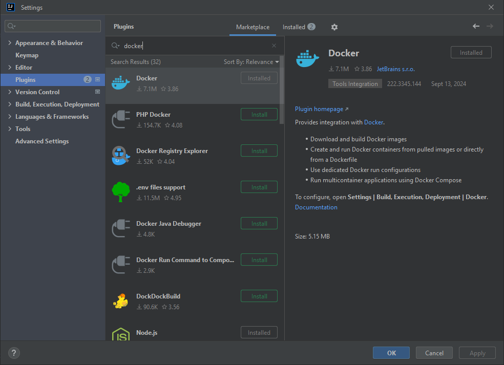

# Lab 01: Quick

The aim of this lab is to set-up our development environment for the module.  There are a number of tools we are using in the module and we will set most of them up today.  The systems we will be using are:

- Java
- IntelliJ
- Maven
- Git and GitHub
- Docker

These provide a modern software development and delivery environment.  These tools will underpin the assessment for the module so getting everything set-up correctly is key.

## Behavioural Objectives

After this lab you will be able to:

- **Setup** a *development environment in IntelliJ.*
- **Setup** a *GitHub repository.*
- **Pull** a *Docker container.*
- **Manage** a *Docker container using basic commands.*
- **Define** a *Dockerfile to create your own container.*
- **Deploy** to a *Docker container from IntelliJ.*

## Getting Started with GitHub

The whole point of version control is to maintain your code somewhere backed-up and shareable with your team.  We will use *GitHub* as a repository for this module.  First, you will need to create an account on GitHub if you haven't already.  Go to [GitHub](https://github.com/) and **Sign Up**.  Two things to note:

1. You do not need a paid for account.
2. If you are a student, GitHub will give you [unlimited private repositories](https://education.github.com/pack).

New projects are started by default on a branch called *main* but IntelliJ uses *master* by default. To change GitHub's default branch name go to [https://github.com/settings/repositories](https://github.com/settings/repositories) and change the default to *master*

Now we can create a new repository. In GitHub, you will see a **+** near the top of the page, which you can select **New repository** from:


This will open a new window.  You need to enter the name for the repository (`devops or whatever you like`), make sure the repository is **Public** and then select the **Apache 2.0** license type. and add a **README.md** file. Details are illustrated below: A md file is a markdown file which gives a quick and easy way to generate web pages from simple text. Have a look at this file in a text editor.


Click on **Create repository** and you will be presented with the following:


## Git Setup

Git is incorporated into IntelliJ but I find it easier to use it from the command line. Download and install Git from https://git-scm.com/download/win

Once installed you can create a new Git Command line window by right clicking in a folder or on the desktop and selecting 


From the command prompt type ```git clone <URL>```

For example ```git clone https://github.com/Kevin-Sim/devops.git```

You might have to set up permissions the first time you do this but this should happen only once.


This will create a folder called devops on your machine and copy the contents of the repository to it.


Note the .git folder which contains information about the repository including a copy off all previous versions of files. This is hidden by default. You can show on Windows using ```view --> show hidden items```

## IntelliJ Setup

IntelliJ IDEA is the Integrated Development Environment that we will be using on the module. You can download IntelliJ IDEA from https://www.jetbrains.com/idea/ The community edition of IntelliJ IDEA is sufficient for this module but you can if you wish get access to the ultimate edition by signing up for a student licence at [https://www.jetbrains.com/shop/eform/students](https://www.jetbrains.com/shop/eform/students)

You will require Java and IntelliJ installed on the machine you plan to work on.  Once ready, start-up IntelliJ.  You should be presented with the following screen: Please note that this software changes regularly and if the screenshots look slightly different it's because I can't keep up. It should be similar and if you encounter any problems please let me know.

Navigate to the folder above your repository. Here it is on my Desktop. The name should match the folder name of your repository. Here devops. Fill in the details as below to create a new Maven Java project


*Replicate the same settings as shown in the image (you can change the location).*  You need to do the following:

1. Select at most 17 as the JDK for the project. The Open JDK Docker image which we will be using uses version 17 and you will get errors if you choose a higher version. 
2. Select **Maven** as the build system

Click **Finish** for your new project to be created.  This should open up the following window which is the Maven configuration file:

Change the Java compliance to at most 11 (below shows Java 10 on lines 11 & 12)


If you do not have this window then try the instructions again and if you still have a problem ask for help at the academic sessions. Please note that in the above screenshot version 11 should be the maximum for maven compiler source and target.

## Git with IntelliJ

Git is also available from IntelliJ. See the full version of Lab01 for details. I find the command line method quicker and easier for integrating a git project (local files) with GitHub (remote repository)

Our next step is to add a `.gitignore` file.  This file tells Git which type of files to ignore.  This is important in software development as compilers and build systems add numerous temporary files and output files that we do not need to track. Ideally only text based files should be in our repository so that we can see changes between file versions. 

To add a `.gitignore` file just add a new file to the project.  To do so, either use the main menu (**File** then **New** then **File**) or **right-click** on the project and select **New** then **File**.  Call the file `.gitignore` and save.  Yes, include the dot in front of the name.  Ensure the name is correct.  Git will only recognise the file with that exact name in the main folder of the repository.

Once the file is created, you need to add the specific files to be ignored by Git. These include Java compiled files, Maven files and IntelliJ configuration files

```shell
# Compiled class file
*.class

# Log file
*.log

# BlueJ files
*.ctxt

# Mobile Tools for Java (J2ME)
.mtj.tmp/

# Package Files #
*.jar
*.war
*.nar
*.ear
*.zip
*.tar.gz
*.rar

# virtual machine crash logs, see http://www.java.com/en/download/help/error_hotspot.xml
hs_err_pid*

# Maven
target/
pom.xml.tag
pom.xml.releaseBackup
pom.xml.versionsBackup
pom.xml.next
release.properties
dependency-reduced-pom.xml
buildNumber.properties
.mvn/timing.properties
.mvn/wrapper/maven-wrapper.jar

# IntelliJ
.idea/
```

This last line will tell Git to ignore the files generated by IntelliJ which are created in the .idea folder.

With these in the `.gitignore` file we can add it to version control.  Using the command line is quick and easy but see the full version of Lab01 to see how to do this from the IDE

```shell
git add . # add all changes (note the full stop for current directory)
git commit -m "initial commit" # commit to git with a descriptive message
git push # push to GitHub
```

The above shows how to add all changes to the repository and synch with GitHub

After **push** refresh the GitHub page.  You should see your files there:


## Hello World Sanity Check

We have done quite a bit so far, but we have yet to write any actual code.  If you set up the project as above then a Main class will have been created. The module focuses on software engineering and methods rather than programming, but it is worth testing things are working.  

In case you missed the check box to create sample code at the start we can add a class as below. Let us build a simple *Hello World* example.

 **Right-click** on the folder **devops->src->main->java** and select **New** then **Package** to open the **New Package** window:


Call the package `com.napier.devops` and click **OK**.  Your **Project Structure** in IntelliJ should now look as follows:


Now **right-click** on **com.napier.devops** and select **New** and **Class** to open the **New Class** window:

Call the class **App** and click **OK**.  IntelliJ will helpfully ask if you want to add the file to your Git repository.  Select **Yes**.(or you can do this later using the three commands above, add, commit, push)

We will add the following code

```java
package com.napier.devops;

public class App
{
    public static void main(String[] args)
    {
        System.out.println("Boo yah!");
    }
}
```

Now select **Build** from the main menu, and then **Build Project**.  If all goes to plan your project will build successfully and we can run it.  Select **Run** then **Run**.  Select **App** as the target, and you should get the output at the bottom of the screen:


We now know that everything is working so far.  So let us commit the changes.  The steps to follow from the terminal

```shell
   git add 
   git commit -m "added hello world"
   git push
```
**Get used to this process - it will save your code from disaster!**.  We have again created a checkpoint where we know our code is working and doing what we expect.  Whenever you do a change - and make your changes small - and tested the build works, commit and push.  I will remind you a few more times, but this is a habit for you to form.

## Getting Started with Docker

We will step away from IntelliJ for a while to use Docker.  Docker will support our deployment to ensure we run in the same configuration wherever we execute our code.  This ensures we do not have conflicts between what works on our development machine and the deployment machine.

### What is Docker (From Mr GPT)

Docker is an open-source platform that automates the deployment, scaling, and management of applications in lightweight, portable containers. Containers are isolated environments that package an application and its dependencies, allowing it to run consistently across different computing environments, from development to production.

Key aspects of Docker:

1. **Containers**: Docker containers encapsulate everything needed to run an application, including code, runtime, libraries, and system tools. This ensures consistency regardless of where the application is executed.
2. **Images**: A Docker image is a read-only template that contains the instructions to create a container. It can include an OS, software, and code. Images can be shared via registries like Docker Hub.
3. **Docker Hub**: This is Docker’s public registry where developers can share, store, and retrieve Docker images.
4. **Portability**: Docker containers can run on any system that supports Docker (Linux, macOS, Windows) without requiring changes to the underlying infrastructure.
5. **Isolation**: Containers run in isolation, meaning each has its own environment, making it ideal for running multiple applications on the same system without conflicts.
6. **Efficiency**: Unlike virtual machines, Docker containers share the host operating system’s kernel, making them more lightweight and faster to start than traditional VMs.

Docker is widely used for simplifying development, testing, and deployment processes, particularly in DevOps and microservices architectures.

### Checking if Docker is Installed and Working

The simplest method to check if Docker is installed on your system is to open a terminal (or Powershell in Windows) and issue the following command:

```shell
docker --version
```

If installed you will get a response as follows:

```shell
Docker version 18.05.0-ce, build f150324782
```

To check if Docker is working correctly use the following command:

```shell
docker run hello-world
```

If Docker is working correctly you should get the following output:

```shell
Unable to find image 'hello-world:latest' locally
latest: Pulling from library/hello-world
9db2ca6ccae0: Pull complete
Digest: sha256:4b8ff392a12ed9ea17784bd3c9a8b1fa3299cac44aca35a85c90c5e3c7afacdc
Status: Downloaded newer image for hello-world:latest

Hello from Docker!
This message shows that your installation appears to be working correctly.

To generate this message, Docker took the following steps:
 1. The Docker client contacted the Docker daemon.
 2. The Docker daemon pulled the "hello-world" image from the Docker Hub.
    (amd64)
 3. The Docker daemon created a new container from that image which runs the
    executable that produces the output you are currently reading.
 4. The Docker daemon streamed that output to the Docker client, which sent it
    to your terminal.

To try something more ambitious, you can run an Ubuntu container with:
 $ docker run -it ubuntu bash

Share images, automate workflows, and more with a free Docker ID:
 https://hub.docker.com/

For more examples and ideas, visit:
 https://docs.docker.com/engine/userguide/

```

The output explains what Docker actually did when you issued the command.  We will cover aspects of these steps in the following sections.

If Docker is installed and working skip to [Basic Docker Usage](#basic-docker-usage).  If not, continue reading.

#### Installing Docker

Installing Docker on Linux is easy - you should find it in your package manager.  For example, with Ubuntu use:

```shell
sudo apt install docker
```

For Windows, use the installation instructions found [here](https://docs.docker.com/docker-for-windows/install/).  For Mac OS X the install instructions are [here](https://docs.docker.com/docker-for-mac/install/).  **Ensure that the Docker service has started**.  See the relevant instructions.  On some systems, Docker is not running at the start.

To test that Docker has been installed correctly, run the following command from the shell:

```shell
docker run hello-world
```

Which should produce output similar to:

```shell
Unable to find image 'hello-world:latest' locally
latest: Pulling from library/hello-world
ca4f61b1923c: Pull complete
Digest: sha256:ca0eeb6fb05351dfc8759c20733c91def84cb8007aa89a5bf606bc8b315b9fc7
Status: Downloaded newer image for hello-world:latest

Hello from Docker!
This message shows that your installation appears to be working correctly.
```

### Basic Docker Usage

Docker and containers are covered in [Lecture 05](../../lectures/lecture05/).  Here we are looking at the basic commands to get us started.

Docker works by providing application containers.  Many container images already exist for our use: go to [Docker Hub](https://hub.docker.com/) and search to see the available options.  This means we can launch applications easily via Docker, including infrastructure services like web servers and databases.

The full version of Lab01 has examples such as pulling a web server in a Linux environment (nginx) but we won't be doing this again so feel free to ignore 

#### Starting Docker Containers

We will be integrating Docker into IntelliJ but as always there's more than one way to do things and we can simply use the command line. Again refer to the complete Lab01 if interested. 

#### Docker Commands Covered

Below are some of the Docker commands available from the command line

| Docker Command | Description |
| ----- | ----- |
| `docker pull <name>` | *Pulls the named Docker image from the server to the local repository allowing it to be instantiated.* |
| `docker run <name>` | *Starts running an instance of the image `name` as a container.* |
| `docker run -d <name>` | *Starts running an instance of the image `name` as a detached container.* |
| `docker run -d -p <local>:<container> <name>` | *Starts a container, mapping the local port `local` to the container port `container`*. |
| `docker run -d --rm <name>` | *Starts running an instance of `name` which will be automatically removed when the container is stopped.* |
| `docker ps` | *Lists running containers.* |
| `docker ps -a` | *Lists all containers.* |
| `docker stop <id>` | *Stops the container with the given `id` which is the `CONTAINER ID` or `NAME`.*|
| `docker rm <id>` | *Removes a container from the local system.* |

### Writing Dockerfiles

Our aim with Docker is to run our applications within containers.  To do this, we need to create our own Docker images, which we do by writing a **Dockerfile**.  A Dockerfile specifies the set-up for a image which we can create containers from, and the syntax is simple.  Writing Dockerfiles falls into *infrastructure as code* since we can define our execution infrastructure in code files (Dockerfiles).

Lets try this on the command line. To start, create a new folder called `test-dockerfile` in the file-system and open the terminal (Powershell, command prompt) in that folder.  Now create a file called `Dockerfile` and use the following:

```docker
FROM ubuntu:latest
CMD ["echo", "'It worked!'"]
```

We have defined two items for our Docker image:

1. It uses the latest Ubuntu image as its parent (base).  This is the `FROM` statement.
2. It executes `echo 'It worked!'` whenever the container is started.  This is the `CMD` statement.

To build our image we use the following (from the directory that `Dockerfile` is saved):

```shell
docker build -t test-dockerfile .
```

The command tells docker to *build* an image (`build`), with the name `test-dockerfile` (`-t` means we are providing a name), and to look for the Dockerfile in the current directory (`.`).  So the command format is:

```shell
docker build -t <name> <folder where Dockerfile lives>
```

When executed you will get the following output:

```shell
Sending build context to Docker daemon  2.048kB
Step 1/2 : FROM ubuntu:latest
latest: Pulling from library/ubuntu
6b98dfc16071: Pull complete
4001a1209541: Pull complete
6319fc68c576: Pull complete
b24603670dc3: Pull complete
97f170c87c6f: Pull complete
Digest: sha256:5f4bdc3467537cbbe563e80db2c3ec95d548a9145d64453b06939c4592d67b6d
Status: Downloaded newer image for ubuntu:latest
 ---> 113a43faa138
Step 2/2 : CMD ["echo", "It worked!"]
 ---> Running in 3fcfdc028360
Removing intermediate container 3fcfdc028360
 ---> 4482338d49b4
Successfully built 4482338d49b4
Successfully tagged test-dockerfile:latest
```

OK, let us run an instance of our image.

```shell
docker run --rm test-dockerfile # --rm means remove container when finished
```

And you should have the received the following output:

```shell
It worked!
```

If so, congratulations!  You have created and run your first personal Docker image.  We will look at further Dockerfile commands as we need them.  Let us get back to IntelliJ.

## Docker in IntelliJ

Thankfully, there is a Docker plug-in for IntelliJ.  To install, in IntelliJ, select **File** then **Settings**, and select **Plugins** on the right-hand side:



You may need to restart IntelliJ before using

Once IntelliJ has restarted we are ready to complete the Docker integration.  Select **File** then **Settings**.  Under **Build, Execution, Deployment**, find the **Docker** section:


**Click** the **+** near the top of the window, and Docker should be detected.  You will know when as the message **Connection successful** will appear as below.  When it does click on **OK**.  


Docker can now be found on the services tab in IntelliJ


## Deploying Our Application to Docker in IntelliJ

We are almost there.  It has been a long process to get to this stage, and it may seem we have not done any software development, which we haven't.  We have setup many processes which means our software development task will be easier.  Trust me!  The process might have been long in this first lab but we have made our lives substantially easier in the future.  Let us finish our process by deploying our application to a Docker image and running it.

To finish our process we need to create a Dockerfile in IntelliJ.  **Right-click** on the project **devops** and select **New** then **File** to open the **New File** window:


Call the file **Dockerfile** and click **OK**.  Select **Yes** to add it to the Git repository.  The contents of the file are as follows:

```docker
FROM openjdk:latest
COPY ./target/classes/com /tmp/com
WORKDIR /tmp
ENTRYPOINT ["java", "com.napier.devops.App"]
```

We are using three new directives here:

1. `COPY` will copy a file or folder from the source on the local machine to the destination in the Docker image.  Here we are copying the folder `com` from `target/classes` in the project to the folder `/tmp/com`.  The source is where IntelliJ has been building our classes.  The destination is the `/tmp` folder in the image.
2. `WORKDIR` states where we want Docker to execute programs from in the container - the *working directory*.  This is `/tmp` - the same location we copied our classes to.
3. `ENTRYPOINT` tells Docker what to execute when the container is created.  That is, run `java` with the class `com.napier.devops.App`.

OK, moment of truth.  On the side of the Dockerfile code you will see two green play buttons that look like run symbols.  This is the easiest way to test our Dockerfile.  


**Click** the **triangles** and select **Run on Docker**.  The image should be built and your Docker containers and images will be updated:


Now add the Dockerfile to our Git repository and push to GitHub:

1. Add files to the commit.
2. Create the commit.
3. Push the commit.

And you are done.  A lot of work just to print out a single string but we are in a good position to carry on in the next lab.  And just one final check for those of you who are interested.  Our created image exists in our local repository.  You can check this by using the `docker images` command:

```shell
docker images
```

You will get an output as follows:

```shell
REPOSITORY          TAG                 IMAGE ID            CREATED             SIZE
<none>              <none>              970c2949b6fc        5 minutes ago       624MB
test-dockerfile     latest              4482338d49b4        3 hours ago         81.1MB
hello-world         latest              2cb0d9787c4d        2 days ago          1.85kB
nginx               latest              3c5a05123222        7 days ago          109MB
openjdk             latest              fe9f7b1e4fa0        10 days ago         624MB
ubuntu              latest              113a43faa138        5 weeks ago         81.1MB
```

The top image is the one IntelliJ just created.  We can create a new instance by using the `IMAGE ID`.  For example, if I run:

```shell
docker run --rm 970c2949b6fc
```

I get the output:

```shell
Boo yah!
```

##### We can share this image on Dockerhub (or via private Docker repositories) so others can run our application easily.

### Some useful docker commands from the command line

Build image from Dockerfile specified in current directory and name the image myapp (lower case only)

``docker build -t "myapp" .   ``

Run myapp image in container named mycontainer

```docker run --name mycontainer myapp  ```

Run myapp image as new container then remove container when app finishes

```docker run -rm myapp  ```

Currently Dockerfile sets the entry point to be the Java App which executes each time the container is started

```java
ENTRYPOINT ["java", "com.napier.devops.App"]
```

Start new container from image with different entrypoint such as a bash command prompt

```
docker run -it --entrypoint /bin/bash myapp
```

This starts a container and opens a terminal inside the tmp directory where we can look at our classes

```shell
bash-4.4# ls -R

./com:
napier

./com/napier:
devops

./com/napier/devops:
App.class
```

Or we can start the code inside the container from the command line

```
bash-4.4# java com.napier.devops.App
Boo Ya!
```

Start an existing stopped container -ai shows output *"Boo Ya"*

```
 docker start -ai mycontainer  
```

list all images

```
docker images
```

list all containers

```
docker ps -a
```

Remove all stopped containers 

```
docker container prune
```

Remove image using name or tag

```
docker rmi myapp
```

Create new image from container (useful if there are changes inside stopped container we want to access again, maybe a python environment with lots of libraries installed)

```
docker commit container_id imagename
```

Copy from container to our file system. Below copies from the root of our code inside the container's /tmp/ directory where we told Docker to copy our code back to a directory called output in the current directory on our filesystem. This allows any output files to be copied back. Also works in reverse 

```
docker cp mycontainer:/tmp/ ./output
```

### Some useful Git commands

created new branch with `git checkout -b lab01 `  

`git checkout -b` is the same as doing 2 commands at once (creates branch and checkout at same time)  

```  
git branch lab01  
git checkout lab01  
```

then when changes finished  

```  
git add .  
git commit - m "created new branch"  
git push origin HEAD  
  
```

we only need  `origin HEAD` on first synch to GitHub`  

Lets merge with master  

```  
git checkout master  
git merge lab01  
git commit -m "merged branch 1"  
git push  
```

Lets tag the master as Lab01 and we can delete Lab01 branch if we want  

```  
git tag Lab01  
git push origin --tags  
  
git push -d origin Lab01 # Delete remote  
git branch -d Lab01 # Delete local  
```

If we need to remove tags  

```  
git push --delete origin Lab01  
git tag -d Lab01 
```
