# Lab 02 Quick : Continuous Integration Setup


In this lab we will automate our build process using [GitHub Actions] (https://github.com/features/actions). CI is [Continuous Integration](https://en.wikipedia.org/wiki/Continuous_integration), a software engineering method where we ensure our local development software versions are merged into the mainline code several times a day. There are several CI approaches available, but GitHub actions is easy to plug into our software production pipeline.

### Behavioural Objectives

After this lab you will be able to:

-   \[ \] **Pull your project** to *return to your previous development state.*

-   \[ \] **Add** *continuous integration to your project.*

-   \[ \] **Integrate** *Docker into CI build step.*

-   \[ \] **Define** the *Gitflow Workflow.*

-   \[ \] **Package** an *application JAR with IntelliJ.*

-   \[ \] **Create** a *release on GitHub.*

### Pulling Back Your Project

At the end of the last lab we had a working application that we could deploy to Docker. Everything was done using three files:

-   A **pom.xml** Maven build file, which we have not explored further yet.
    
-   An **App.java** code file that contains our current code which is just a *Hello World* example.
    
-   A **Dockerfile** that specifies how to run our application in a separate Docker container.

We have three other files in our repository:

-   A **.gitignore** file to tell Git which files and folders to ignore for versioning.
    
-   A **README.md** file for our project.

-   A **LICENSE** file defining the licensing terms for our project.

Everything is in our GitHub repository. We can pull this back in IntelliJ to start from where we left off. If your code is still on the machine you are using you can ignore this step.

### Starting IntelliJ

If you are using your own machine IntelliJ will open the last project that was opened. If not then you will need to clone the project from your GitHub Repository


IntelliJ Start Window

The button to click on is **Get from VCS**, then select **Git**:


IntelliJ Import from Git

If you have not saved login credentials you may be asked to provide these There are different ways to do this and it continually changes. Try From File->Settings->Version Control->GitHub then click the + and Login with Token. In the window that pops up click generate. This will take you to GitHub where you can generate a token and paste it into IntelliJ


Adding CI to Your Repository
----------------------------

We can now set-up GitHub Actions. On your GitHub repository select the actions tab at the top then select *set up workflow yourself*


This will create a file in your repository named 

`.github/workflows/main.yml`

Replace the default text with the following

```yml
name: A workflow for my Hello World App
on: push

jobs:
  build:
    name: Hello world action
    runs-on: ubuntu-20.04
    steps:
      - name: Checkout
        uses: actions/checkout@v2
      - name: Set up JDK 11
        uses: actions/setup-java@v2
        with:
          java-version: '11'
          distribution: 'adopt'
      - name: Compile with Maven
        run: mvn compile
      - name: Build Docker Image
        run: docker build -t devopsimage .
      - name: Run image
        run: docker run --name devopscontainer -d devopsimage
      - name: view logs
        run: docker logs devopscontainer
```

To sync our local version do a pull from IntelliJ 

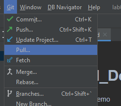

Or from the terminal 

```
git pull
```


To check if our CI workflow is working make some changes and push them to GitHub

1. Add some text to your `Readme.md` file.
2. Add the updates to the commit.
3. Create a commit.  Use a sensible message.
4. Push the commit.

Now we can go to GitHub see if our build was successful.  

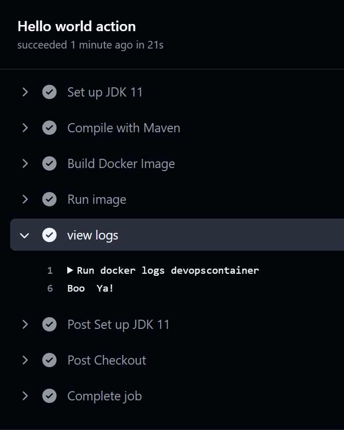


The stages shown above duplicate the stages in our workflow file that we defined above main.yml

### Adding Build Badge

You might have seen build status badges on GitHub before like this one:

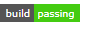

You can add the badge for your build status to your `README.md` file as well.  To do this, add the following text to your `Readme.md` file

```

```

Now go through our Git update steps:

1. Add files to commit.
2. Create commit.
3. Push to GitHub.

Now if you go to your GitHub page you should see the following:

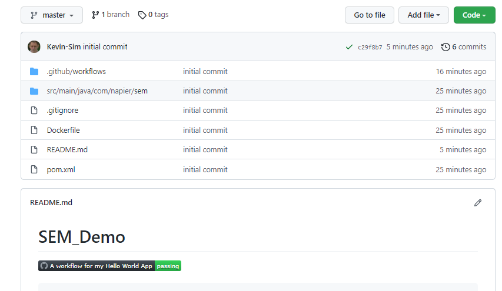 


And now we have our project automatically building on pushes to GitHub, and the current build status

### Other Badges

You can add various badges to your project.  [Sheilds.io](https://shields.io/) is one such site that provides badges.  We are going to add two to our `README.md`: one for our license and one for our release.  The license badge takes the URL:

`[](https://github.com/<github-username>/devops/blob/master/LICENSE)`

Just replace `<github-username>` with your GitHub username.  The release badge is:

`[](https://github.com/<github-username>/devops/releases)`

And then update your GitHub repository:

1. Add files to commit.
2. Create commit.
3. Push to GitHub.

If you go to your repository's dashboard in GitHub you should see your new badges.

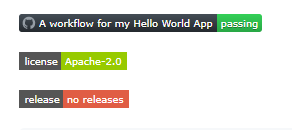


## Setting up Gitflow Workflow

Our next step is to set-up our workflow.  This is our approach to managing separate features and collaborators in our project.  [Gitflow](https://www.atlassian.com/git/tutorials/comparing-workflows/gitflow-workflow) is one such workflow that works well with Git.  Gitflow is examine further in [Lecture 02](../../lectures/lecture02).  To work with Gitflow we manage several branches:

- **master** which is the main Git branch.  This is created automatically when a Git repository is created.  Only main releases are tracked in this branch.
- **develop** is the integration branch.  Features are merged into this branch as they are completed. It is a *feature integration* branch.
- **feature** branches are where new features are worked on before integration with with `develop`.
- **release** is where releases are made.  A release is normally a collection of features, or a set point in time.  Note that a release must be a working version.  The `release` branch comes from a version of `develop`.  `master` is a version of `release`.
- **hotfix** branches are *maintenance* ones based on `master`.  We are fixing a production version of the code, so rather than working from `develop` we work from `master`.

### Develop Branch

The first step in setting up Gitflow is the creation of a `develop` branch in our project.  We can do this in IntelliJ.  Select **VCS**, **Git** then **Branches...** to open the branches window:

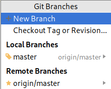

Select **New Branch** and call the branch **develop**.  Make sure the **Checkout branch** checkbox is ticked.

The `develop` branch only exists on the local system.  To add it to GitHub we have to perform a push.  Do this now.  From IntelliJ, **VCS**, **Git** then **Push**. Click **Push** and the branch will be added to GitHub. You can confirm this on GitHub by opening the branches drop-down, refreshing the page if you are currently on it:

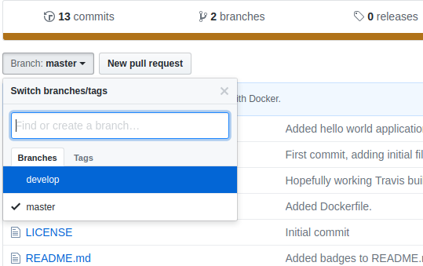

#### Adding Develop Build Status to GitHub

GitHub will have automatically added this branch to its build.  As `develop` is a key branch of our project we will add this build status to the `README.md` file.  

This time I will use Shields.io to create a build badge. Go to [https://shields.io/category/build](https://shields.io/category/build) and select GitHub Workflow Status (branch). Fill in the UserName, RepositoryName, Workflow name (taken from the main.yml file)  and branch name

Update the `README.md` as below (keep the other badges):

```markdown
# DevOps

```

And add this to GitHub:

1. Add files to commit.
2. Create commit.
3. Push commit to GitHub.

And if you go to the dashboard for the repository on GitHub you will see that nothing has changed.  That is because we have pushed to our `develop` branch, not the `master` branch.  You can see the updates by switching to the `develop` branch on GitHub using the branches drop-down from earlier:

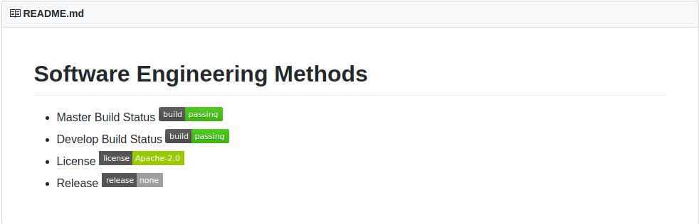

## Updating our Example Application

#### Creating a Self-contained JAR

So far we have not been doing good practice.  For Java, JAR (Java ARchive) files should be deployed and not individual code files as we have been doing.  The advantage of a JAR file is it can contain library dependencies, such as the MySQL dependency we will be using for the coursework. Maven can build this for us automatically.

First we must update our `pom.xml` file.  It should now look as follows. 

```xml
<?xml version="1.0" encoding="UTF-8"?>
<project xmlns="http://maven.apache.org/POM/4.0.0"
         xmlns:xsi="http://www.w3.org/2001/XMLSchema-instance"
         xsi:schemaLocation="http://maven.apache.org/POM/4.0.0 http://maven.apache.org/xsd/maven-4.0.0.xsd">
    <modelVersion>4.0.0</modelVersion>

    <groupId>com.napier.devops</groupId>
    <artifactId>devops</artifactId>
    <version>1.0.0</version>

    <properties>
        <maven.compiler.source>11</maven.compiler.source>
        <maven.compiler.target>11</maven.compiler.target>
        <project.build.sourceEncoding>UTF-8</project.build.sourceEncoding>
    </properties>

    <dependencies>
        <dependency>
            <groupId>mysql</groupId>
            <artifactId>mysql-connector-java</artifactId>
            <version>8.0.33</version>
        </dependency>
    </dependencies>
    
    <build>
        <plugins>
            <plugin>
                <groupId>org.apache.maven.plugins</groupId>
                <artifactId>maven-assembly-plugin</artifactId>
                <version>3.3.0</version>
                <configuration>
                    <finalName>devops</finalName>
                    <archive>
                        <manifest>
                            <mainClass>com.napier.devops.App</mainClass>
                        </manifest>
                    </archive>
                    <descriptorRefs>
                        <descriptorRef>jar-with-dependencies</descriptorRef>
                    </descriptorRefs>
                    <appendAssemblyId>false</appendAssemblyId>
                </configuration>
                <executions>
                    <execution>
                        <id>make-assembly</id>
                        <phase>package</phase>
                        <goals>
                            <goal>single</goal>
                        </goals>
                    </execution>
                </executions>
            </plugin>
        </plugins>
    </build>
</project>
```

A brief explanation of the sections.

1. <properties> - here we are telling Maven to produce Java 11
2. <dependencies> here we are including any external libraries we want to include 
3. <build>  there is quite a bit going on here.  You can happily reuse the code though:
    - We are defining how Maven assembles the JAR file.
    - We are telling Maven which class to run when the JAR is executed 
    - We are telling Maven to build the `jar-with-dependencies - in other words pull in any external  dependencies that are not part of the java environment

 We can now ask Maven to package up our application.  In IntelliJ open the **Maven Panel** on the right hand side:

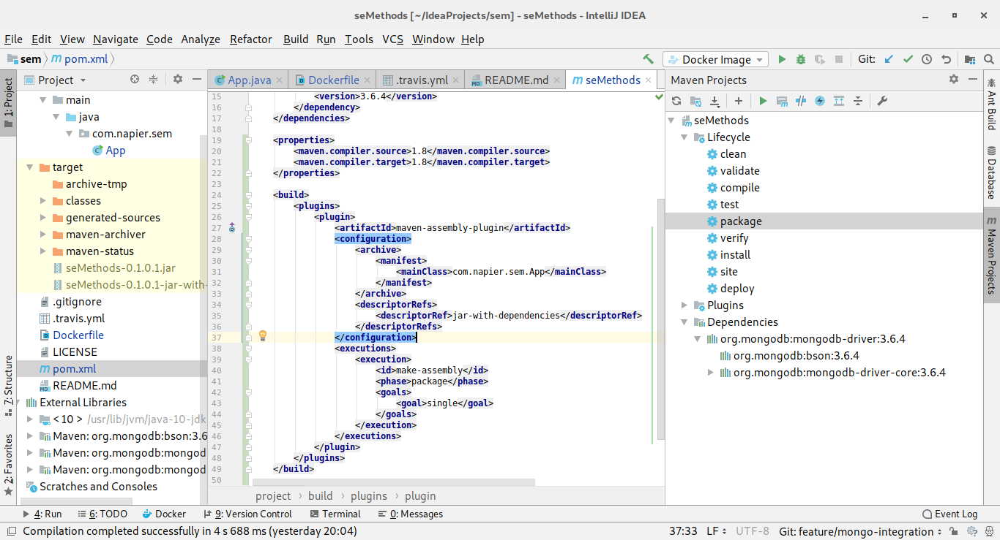

Open the **Lifecycle** collapsed menu, and select **package** and click the **green triangle in the Maven panel** to start the package process.  This will take a few seconds as your code and the external JAR libraries are combined into a single JAR.  You will see this in the **target** folder in the **Project Structure** as `devop.jar`.  So we have successfully built our project into a single JAR for deployment.  

Lets change our Dockerfile to use the jar instead of the class files

```dockerfile
FROM openjdk:latest
COPY ./target/devops.jar /tmp
WORKDIR /tmp
ENTRYPOINT ["java", "-jar", "devops.jar"]
```

Execute the Dockerfile to check its all working

Now we will update our github workflow (Main.yml in the .github/workflows directory) 

Change the section compile with maven to package with maven package 

```yml
    - name: Package with Maven
      run: mvn package
```

Time to push to GitHub.

1. Add files to commit.
2. Create commit.
3. Push to GitHub.
4. Check actions is still successful 


#### Version Tags

Git commits can also be tagged.  To do this in IntelliJ, select **Git** then **New Tag** to open the **Tag** window:

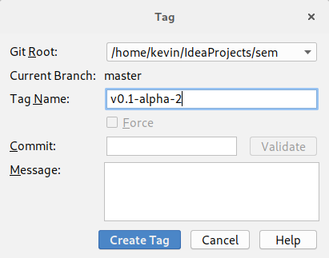

Use the name provided, and click **Create Tag**.  Now we just need to `push` the tag to GitHub.  Select push, but this time ensure the **Push Tags** checkbox is ticked as indicated:

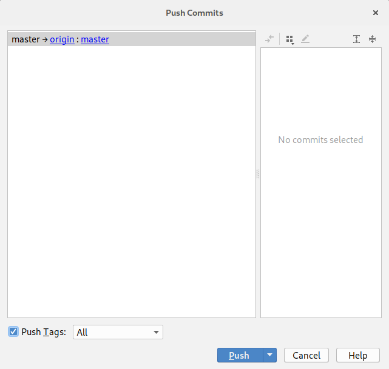

Click **Push** and your tag will be added to GitHub.

#### GitHub Release

Now to create a release on GitHub.  Go to the GitHub page for your project and select the **Releases** tab to open the following window:

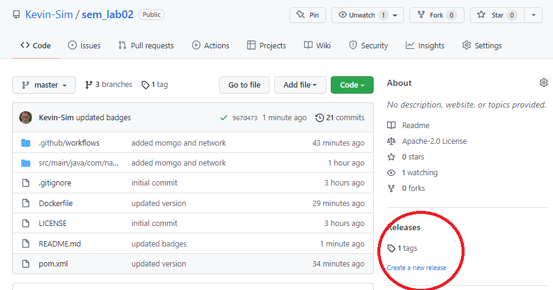

Click **Create new release** to start entering the release details:

The details we want are below:

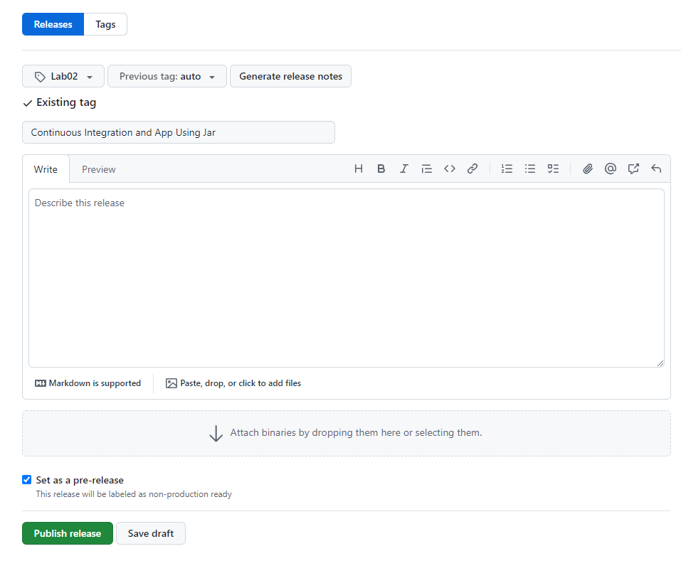

Also make sure the checkbox **This is a pre-release** is ticked.  Then click **Publish release**.  Your release details will then be presented:

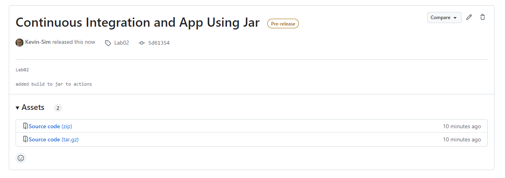

### Clearing Up

Before stepping away from your machine there are some things you should do:

1. Stop any running Docker containers.
2. Delete any unneeded containers.
3. Delete any unneeded images.
4. Ensure any changes have been pushed.

With that done, you can happily walk away from the machine.

### Our Current Process

This is our current workflow.  This is an important set of steps so document them:

1. Pull the latest `develop` branch.
2. Start a new feature branch.
3. Once feature is finished, create JAR file.
4. Update and test Docker configuration with GitHub Actions.
5. Update feature branch with `develop` to ensure feature is up-to-date.
6. Check feature branch still works.
7. Merge feature branch into `develop`.
8. Repeat 2-7 until release is ready.
9. Merge `develop` branch into `release` and create release.
10. Merge `release` into `master` and `develop`.