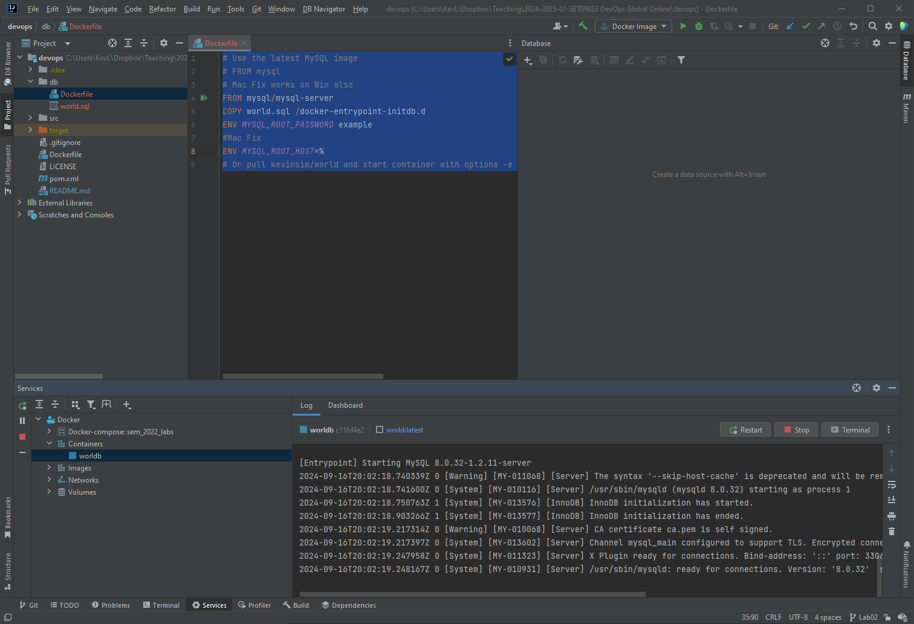
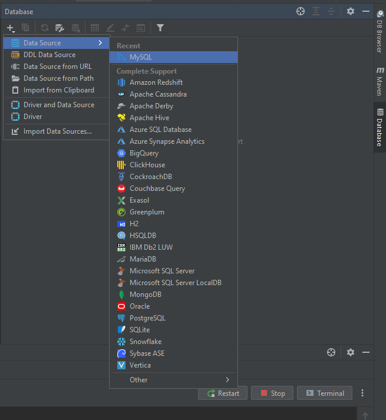
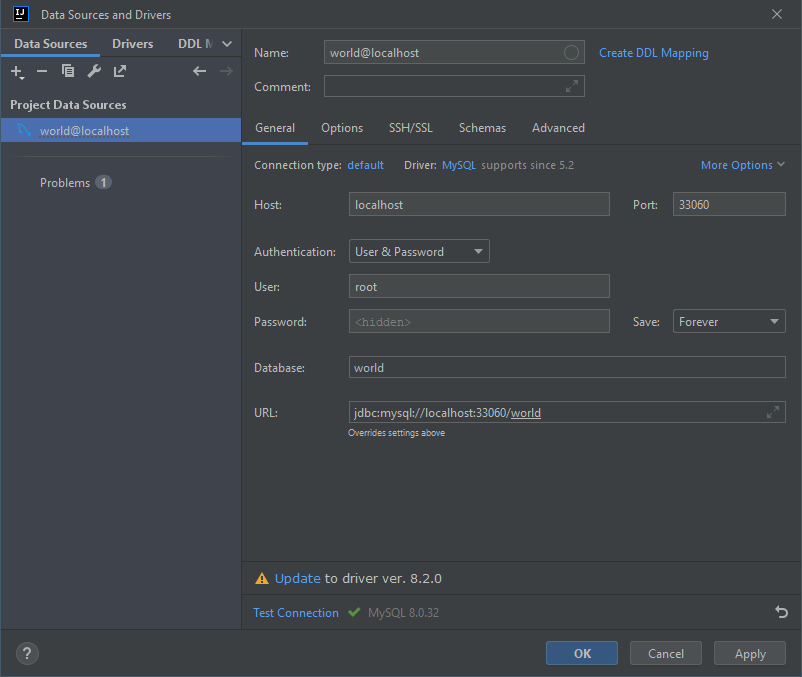
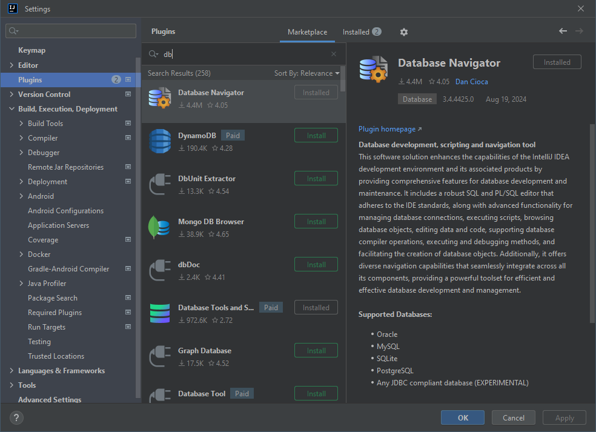
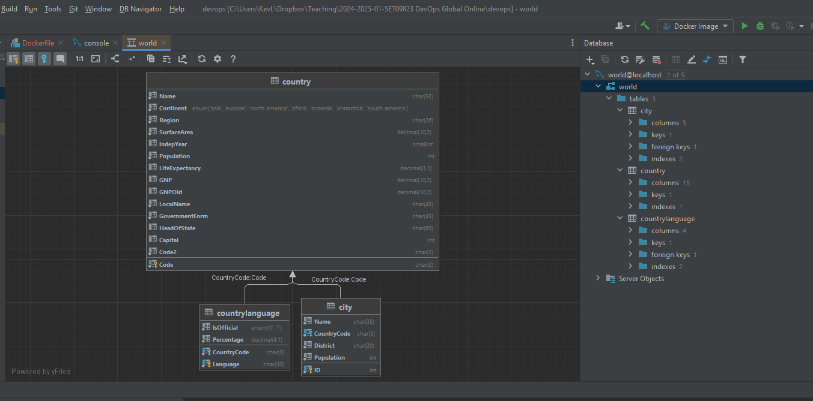
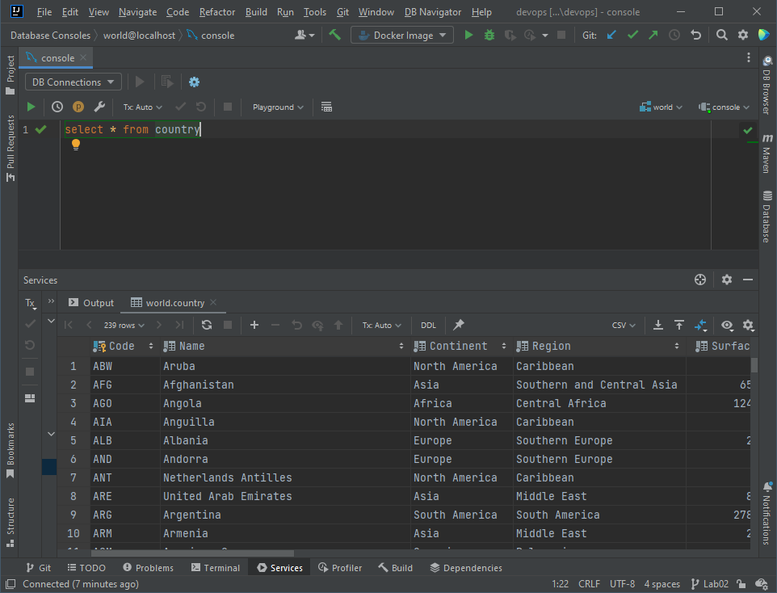
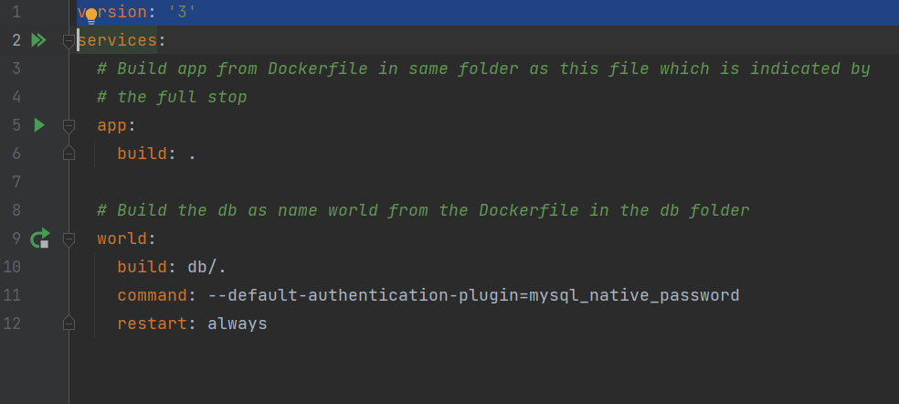
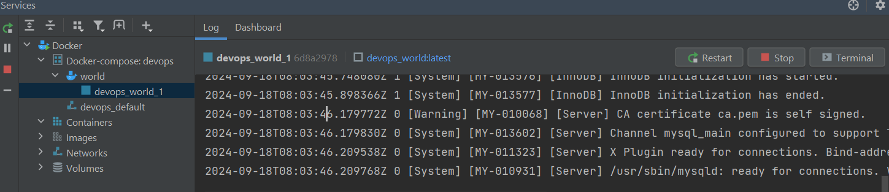
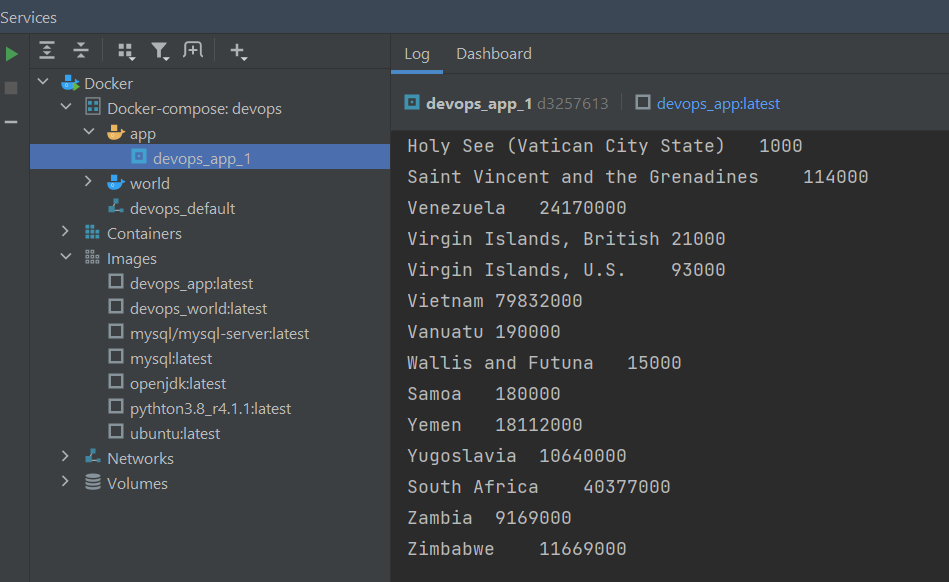
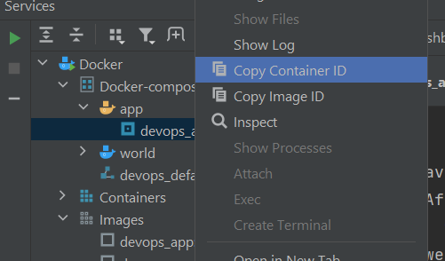

## Lab 03 Quick

This cut down version of parts of labs 2 & 3a and covers

- Set up world database  
- build MySQL image using Dockerfile  
- Run database in docker container
- connect using database navigator built in to IntelliJ
- Modify App to connect to database and test locally 
- Set up docker-compose so two containers can speak to each other 
- Create 2 containers one for Db and one for App Start Using docker-compose and check they can communicate


### Set up World MySQL database

Create a folder db and inside create a file Dockerfile and add the following

```dockerfile
FROM mysql:latest
COPY world.sql /docker-entrypoint-initdb.d
ENV MYSQL_ROOT_PASSWORD example
# Mac Fix
ENV MYSQL_ROOT_HOST=%
```
Download the world database from https://downloads.mysql.com/docs/world-db.zip. Extract the world.sql file to the same directory as the Dockerfile


Build an image called world from the command line using the Dockerfile in the folder db

```shell
docker build -t world db/  
```

Create and run a container called worlddb from the world image forwarding the MySql port 3306 inside the container to port 33060 on our local machine by adding -p 33060:3306 to the run options. We also need to supply the MySql password we set in the Dockerfile ("example") -d specifies it will run in background mode

```
docker run --name=worlddb -p 33060:3306 -e MYSQL_ROOT_PASSWORD=example -d world 

```

Check it is running on the service tab



Connect via Database Tools Window.. If it's not visible then it should be at **View | Tool Windows | Database**

Create a new MySQL connection by clicking the + at the top left



Fill in details as below using the password set in the Dockerfile *"example*"  Fill in port, user, password and database

Click Test Connection at the bottom




You can also add Database Navigator which I do not think is needed. If you don't have it installed get it through the market place 

```
File->Settings->Plugins
```




We can now explore the database, generate entity relationship diagrams and get a MySQL prompt for running queries



Simple Query



### Some other useful IntelliJ Features include POJO 
POJO

### Modify App to connect to Db 

We now have a database running in a Docker image that we can access on our local machine because we have forwarded the internal MySQL port 3306 inside the container to port 33060 on our local machine.

Our App currently prints hello world or similar. Lest modify it to query the database.

We have already included the required dependency in our Maven build  configuration file`pom.xml`

```xml
    <dependencies>
        <dependency>
            <groupId>mysql</groupId>
            <artifactId>mysql-connector-java</artifactId>
            <version>8.0.33</version>
        </dependency>
    </dependencies>
```

Lets modify our App java code

**Below will work by running java locally to connect to docker image on 33060 NEEDS Work  to make easier going forward including  comments and copy output back to image / git**


```java
package com.napier.devops;

import java.io.BufferedWriter;
import java.io.File;
import java.io.FileWriter;
import java.sql.*;

public class App {

	/**
	 * Connection to MySQL database.
	 */
	private Connection con = null;
	public static void main(String[] args) {
		// Create new Application
		App a = new App();

		if (args.length < 1) {
			a.connect("localhost:33060", 0);
		} else {
			a.connect(args[0], Integer.parseInt(args[1]));
		}
        
		a.report1();

		// Disconnect from database
		a.disconnect();
	}

	public void report2() throws IOException {
		StringBuilder sb = new StringBuilder();
		try {
			// Create an SQL statement
			Statement stmt = con.createStatement();
			// Create string for SQL statement
			String sql = "select * from country";
			// Execute SQL statement
			ResultSet rset = stmt.executeQuery(sql);
			//cycle
			while (rset.next()) {
				String name = rset.getString("name");
				Integer population = rset.getInt("population");
				sb.append(name + "\t" + population + "\r\n");
			}
			new File("./tmp/").mkdir();
			BufferedWriter writer = new BufferedWriter(
					new FileWriter(new File("./tmp/report1.txt")));
			writer.write(sb.toString());
			writer.close();
			System.out.println(sb.toString());
		} catch (Exception e) {
			System.out.println(e.getMessage());
			System.out.println("Failed to get details");
			return;
		}
        // write to file
		new File("./output/").mkdir();
		BufferedWriter writer = new BufferedWriter(
				new FileWriter(new File("./tmp/report1.txt")));
		writer.write(sb.toString());
		writer.close();
		System.out.println(sb.toString());
	}

	/**
	 * Connect to the MySQL database.
	 *
	 * @param conString
	 * 		Use db:3306 for docker and localhost:33060 for local or Integration
	 * 		Tests
	 * @param
	 */
	public void connect(String conString, int delay) {
		try {
			// Load Database driver
			Class.forName("com.mysql.cj.jdbc.Driver");
		} catch (ClassNotFoundException e) {
			System.out.println("Could not load SQL driver");
			System.exit(-1);
		}

		int retries = 10;
		for (int i = 0; i < retries; ++i) {
			System.out.println("Connecting to database...");
			try {
				// Wait a bit for db to start
				Thread.sleep(delay);
				// Connect to database
				//Added allowPublicKeyRetrieval=true to get Integration Tests
				// to work. Possibly due to accessing from another class?
				con = DriverManager.getConnection("jdbc:mysql://" + conString
						+ "/world?allowPublicKeyRetrieval=true&useSSL"
						+ "=false", "root", "example");
				System.out.println("Successfully connected");
				break;
			} catch (SQLException sqle) {
				System.out.println("Failed to connect to database attempt "
						+ Integer.toString(i));
				System.out.println(sqle.getMessage());
			} catch (InterruptedException ie) {
				System.out.println("Thread interrupted? Should not happen.");
			}
		}
	}
	/**
	 * Disconnect from the MySQL database.
	 */
	public void disconnect() {
		if (con != null) {
			try {
				// Close connection
				con.close();
			} catch (Exception e) {
				System.out.println("Error closing connection to database");
			}
		}
	}
}
```


If we run this code locally (not from docker) then it will connect on port 33060

However,  want our application to communicate with the database from within a separate docker container.

The original version of Lab02 & 3 shows how to set up a docker network and run different containers on that network to facilitate communications. However a much easier method is to use docker-compose which is a docker utility that can be used to start multiple images that are automatically able to communicate.

### Set up docker-compose so two containers can speak to each other 

add a file called `docker-compose.yml` in the root of your project and add the following

```yml
version: '3'
services:
  # Build app from Dockerfile in same folder
  app:
    build: .

  # Build the db as name world from the Dockerfile in the db folder
  world:
    build: db/.    
    # keep port forwarding so we can test app locally without docker
    ports:
      - "33060:3306"
```

Change the code block in main to

```java
public static void main(String[] args) {
		// Create new Application
		App a = new App();

		if (args.length < 1) {
			//local
			a.connect("localhost:33060", 0);
		} else {
			//docker parameters passed from Dockerfile
			a.connect(args[0], Integer.parseInt(args[1]));
		}

		a.report1();

		// Disconnect from database
		a.disconnect();
}
```

Modify the app Dockerfile in root to the following

```dockerfile
FROM openjdk:latest
COPY ./target/devops.jar /tmp
WORKDIR /tmp
# change last parameter to 10000 if running on github actions
#if running locally and database aleady started delay can be zero
ENTRYPOINT ["java", "-jar", "devops.jar", "world:3306", "0"]
```

Note the last line now passes two parameters that are passed to our app so that the connection changes from localhost:33060 to world:3306. The last parameter (delay in milliseconds before  trying connection) needs changed to something  large 10000 if running on github actions or if the database isn't already running.

**Repackage the code using Maven to update the jar** Remember to do this each time you change the code. It's also good to **remove any out of date docker images and containers** otherwise docker-compose will just use them rather than rebuilding

Start the database using docker compose using the green arrow next to the db specification. (Mine is already running)



Wait until the database is ready



run the app from docker-compose

you should get output as follows



A text file will also be created inside the docker container

We can copy this back to our file system as follows

docker cp <container ID>:/tmp/output/ ./output

Get the container ID (long hash) by right click on the container




mine is `ef389599faf1c3f62f3d8df004c8d35652712757b8027ad77d46649fd569c60b`

or we can use the container name
```shell
docker cp devops_app_1:/tmp/output/ ./output
```

This should copy the files back to our project in a folder called output (you might want to add this folder to .gitignore)

### Integrate into GitHub Actions

To do this simply change the GitHub actions script to run docker compose rather than docker

Replace the lines

```yml
      - name: Build Docker Image
        run: docker build -t devopsimage .
      - name: Run image
        run: docker run --name devopscontainer devopsimage
```

with 

```docker
      - name: Run docker compose
        run: docker compose up --abort-on-container-exit
```

Also the name of the container has now changed to 
```
<repository name>-<container name>-1
```
So for me that is `devops3-app-1`

So change the View Logs entry in the actions script to 

```docker
  - name: view logs
    run: docker logs devops3-app-1
```