# Lab 06: Unit Testing

In this lab we will add automated testing to our code.  Unit Testing is a technique for testing individual *units* of code.  A unit is a piece of functionality - normally an individual pathway through a method.  We can write code that will test this branch of the application, and thus automate our testing process.  This will give us confidence in our code as we continue to develop it.

## Behavioural Objectives

-  **Describe** a *unit test.*
-  **Create** *unit tests*.
-  **Execute** *unit tests in IntelliJ.*
-  **Use code coverage** to *visualise code tested.*

## What is Unit Testing?

[Wikipedia](https://en.wikipedia.org/wiki/Unit_testing) defines unit testing as (emphasis mine):

> In computer programming, unit testing is a **software testing method** by which **individual units of source code, sets of one or more computer program modules** together with associated control data, usage procedures, and operating procedures, **are tested to determine whether they are fit for use**.

Also from Wikipedia:

> Intuitively, one can view a unit as **the smallest testable part of an application**.

From these statements, we can define unit testing as:

- a *software testing method*.
- testing the *smallest part of an application*.
- to determine *fitness for use*.

Let us look at an example:

```java
public int method(String str)
{
    if (str != null)
        return str.length();
    else
        return -1;
}
```

Here we have two pathways through our code: the two branches of the `if` statement.  A unit test would test one of these branches to see if it works correctly.  That means we need at least two unit tests:

1. When `str` is not `null`.
2. When `str` is `null`.

Example unit tests here could be:

```java
@Test
public void testMethod1()
{
    assertEqual(5, method("Hello"));
}
```

The unit test is checking if `method` will return `5` when `Hello` is provided as an input.  The `assertEquals` means that if `method` does not return `5` then the test will fail.

We also need a test for the other path, when the parameter passed to the method is `null`

```java
@Test
public void testMethod1()
{
    assertEqual(-1, method(null));
}
```

Unit testing is a **fundamental** part of software development and you should start using it as common practice from now on.  There are unit testing frameworks for most languages.  We will cover how to get started with Maven an IntelliJ in this lab.  There is plenty of material online on other approaches in other languages.

To use the Unit testing framework we need to add the JUnit dependency and Maven plugin to pom.xml. Your pom.xml should now look like:

```xml
<?xml version="1.0" encoding="UTF-8"?>
<project xmlns="http://maven.apache.org/POM/4.0.0"
         xmlns:xsi="http://www.w3.org/2001/XMLSchema-instance"
         xsi:schemaLocation="http://maven.apache.org/POM/4.0.0 http://maven.apache.org/xsd/maven-4.0.0.xsd">
    <modelVersion>4.0.0</modelVersion>

    <groupId>com.napier.devops</groupId>
    <artifactId>DevOps3</artifactId>
    <version>1.0.0</version>

    <properties>
        <maven.compiler.source>17</maven.compiler.source>
        <maven.compiler.target>17</maven.compiler.target>
        <project.build.sourceEncoding>UTF-8</project.build.sourceEncoding>
    </properties>

    <dependencies>
        <dependency>
            <groupId>mysql</groupId>
            <artifactId>mysql-connector-java</artifactId>
            <version>8.0.33</version>
        </dependency>
        <dependency>
            <groupId>org.junit.jupiter</groupId>
            <artifactId>junit-jupiter-api</artifactId>
            <version>5.1.0</version>
            <scope>test</scope>
        </dependency>
    </dependencies>

    <build>
        <plugins>
            <plugin>
                <groupId>org.apache.maven.plugins</groupId>
                <artifactId>maven-assembly-plugin</artifactId>
                <version>3.3.0</version>
                <configuration>
                    <finalName>devops</finalName>
                    <archive>
                        <manifest>
                            <mainClass>com.napier.devops.App</mainClass>
                        </manifest>
                    </archive>
                    <descriptorRefs>
                        <descriptorRef>jar-with-dependencies</descriptorRef>
                    </descriptorRefs>
                    <appendAssemblyId>false</appendAssemblyId>
                </configuration>
                <executions>
                    <execution>
                        <id>make-assembly</id>
                        <phase>package</phase>
                        <goals>
                            <goal>single</goal>
                        </goals>
                    </execution>
                </executions>
            </plugin>
            <plugin>
                <groupId>org.apache.maven.plugins</groupId>
                <artifactId>maven-surefire-plugin</artifactId>
                <version>2.19.1</version>
                <dependencies>
                    <dependency>
                        <groupId>org.junit.platform</groupId>
                        <artifactId>junit-platform-surefire-provider</artifactId>
                        <version>1.1.0</version>
                    </dependency>
                    <dependency>
                        <groupId>org.junit.jupiter</groupId>
                        <artifactId>junit-jupiter-engine</artifactId>
                        <version>5.1.0</version>
                    </dependency>
                </dependencies>
            </plugin>
        </plugins>
    </build>
</project>
```

### Our First Unit Test

We are now ready to write our first unit test. In Java, it is traditional and considered good practice to store test classes in a separate directory. Let us do this now:

1. **Add a new folder - test - to the src folder of the project**.
2. **Add a new folder - java - to the test folder**.
3. **Add a new file - MyTest.java - to the new java folder**.
4. **Add the following code to MyTest.java**:

```java
import org.junit.jupiter.api.*;
import static org.junit.jupiter.api.Assertions.*;


class MyTest
{
	@Test
	void unitTest()
	{
		assertEquals(5, 5);
	}
}
```


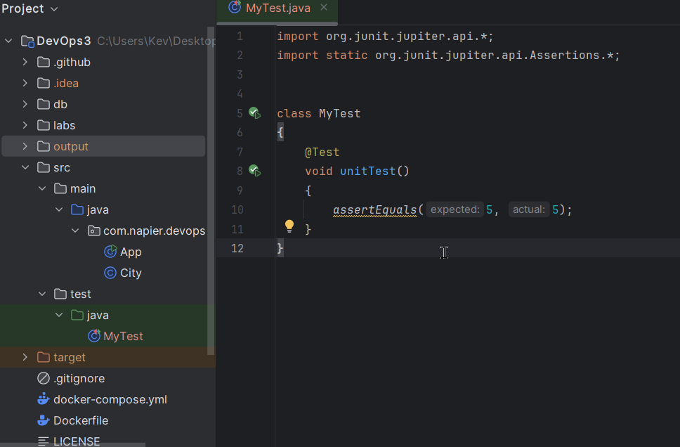

### Running the Tests via Maven

To run the test using Maven, **open the Maven view on the right** and select the **test lifecycle stage**. Maven should build your code and run the tests, providing the following output:

```
-------------------------------------------------------
 T E S T S
-------------------------------------------------------
Running MyTest
Tests run: 1, Failures: 0, Errors: 0, Skipped: 0, Time elapsed: 0.008 sec - in MyTest

Results :

Tests run: 1, Failures: 0, Errors: 0, Skipped: 0
```

So our test had 0 failures and 0 errors, so it passed.

### Running Tests

To run the tests you should just be able to **click the green run button**.  If not, ensure that the new build configuration is selected as the run target and try again.  Once completed, you should get the following output:

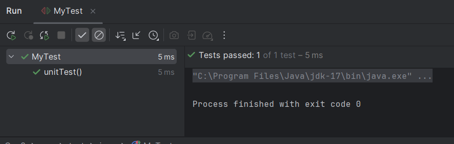

The green tick means the test passed.  Now let us see what happens when a test fails.  Add the following code to `MyTest`:

```java
@Test
void unitTest2()
{
    assertEquals(5, 4);
}
```

Run the tests again and this time you will get the following:

`unitTest2` has failed, and on the right we see why:

```shell
Expected :5
Actual   :4
```


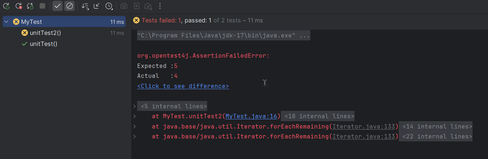

### Other Test Examples

Add the following to `MyTest`.  They illustrate some other test types:

```java
@Test
void unitTest3()
{
    assertEquals(5, 5, "Messages are equal");
}

@Test
void unitTest4()
{
    assertEquals(5.0, 5.01, 0.02);
}

@Test
void unitTest5()
{
    int[] a = {1, 2, 3};
    int[] b = {1, 2, 3};
    assertArrayEquals(a, b);
}

@Test
void unitTest6()
{
    assertTrue(5 == 5);
}

@Test
void unitTest7()
{
    assertFalse(5 == 4);
}

@Test
void unitTest8()
{
    assertNull(null);
}

@Test
void unitTest9()
{
    assertNotNull("Hello");
}

@Test
void unitTest10()
{
    assertThrows(NullPointerException.class, this::throwsException);
}

void throwsException() throws NullPointerException
{
    throw new NullPointerException();
}
```

- `unitTest3` illustrates how we can add a message to a test.
- `unitTest4` illustrates how to test floating point values with an error range.
- `unitTest5` illustrates how to compare array contents in a test.
- `unitTest6` illustrates how to test if a value is `true`.
- `unitTest7` illustrates how to test if a value is `false`.
- `unitTest8` illustrates how to test if a value is `null`.
- `unitTest9` illustrates how to test if a value is not `null`.
- `unitTest10` illustrates how to test if a method throws an exception.  By default, any exception thrown fails a test if no `assertThrows` matches.

## Adding Tests to the Application : Printing City Reports

Let us add unit tests to our Application. Suppose we have the following method in our App class

```java
    public void printCityReport(ArrayList<City> cities){
        for(City city : cities){
            System.out.println(city);
        }
    }
```

We can add Unit tests to check for different conditions that may cause a failure

```java
	@Test
	void printCitiesTestNull()
	{
		app.printCityReport(null);
	}
```

Running this test fails as the method doesn't deal with a null object passed as a parameter

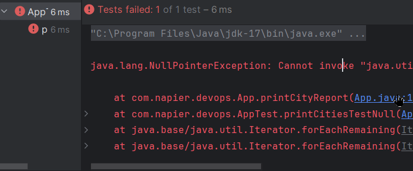

Lets modify the method to check for null values

```java
	public void printCityReport(ArrayList<City> cities){
		if(cities == null){
			System.out.println("No cities found");
			return;
		}
		for(City city : cities){
			System.out.println(city);
		}
	}
```

Running the test again now passes.

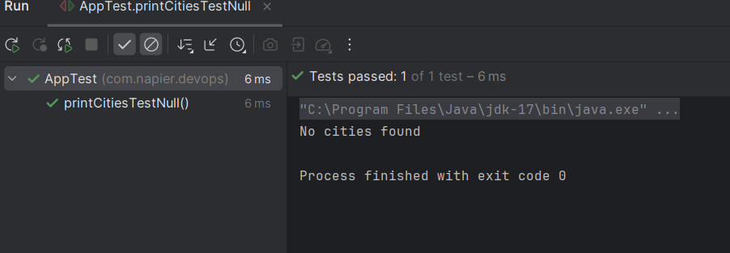

#### Cities is Empty

Let us test what happens when `cities` is empty:

```java
@Test
void printSalariesTestEmpty()
{
    ArrayList<Employee> employess = new ArrayList<Employee>();
    app.printSalaries(employess);
}
```

All tests pass, so let us move on.

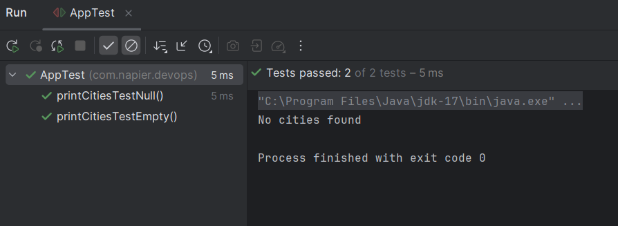

We should also test for null values in the list of cities

```java
.. I'll leave that one for you
```

And we should include a test for the normal condition

```java
	@Test
	void printCitiesTestNormal() {
		ArrayList<City> cities = new ArrayList<>();
		City city = new City(458, "Glasgow", "GBR", "Scotland", 619680);
		cities.add(city);
		city = new City(459, "Liverpool", "GBR", "England", 461000);
		cities.add(city);
		city = new City(460, "Edinburgh", "GBR", "Scotland", 450180);
		cities.add(city);
		app.printCityReport(cities);
	}
```

This test will also pass.

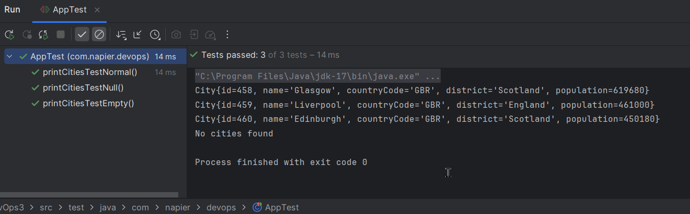

## Code Coverage

To end our examination of unit testing we will look at **Code Coverage**. Coverage allows us to examine how much of our code is tested.

Select the package under test and from the context menu (right click) select run tests with coverage

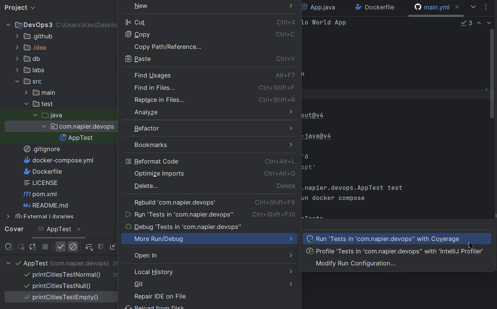

Alternatively this can be accessed via Run -> Edit Configurations. Select the package configuration and **Click OK** to close the window. Then **select Run and Run with Coverage.** This will open the **Code Coverage View** on the right:

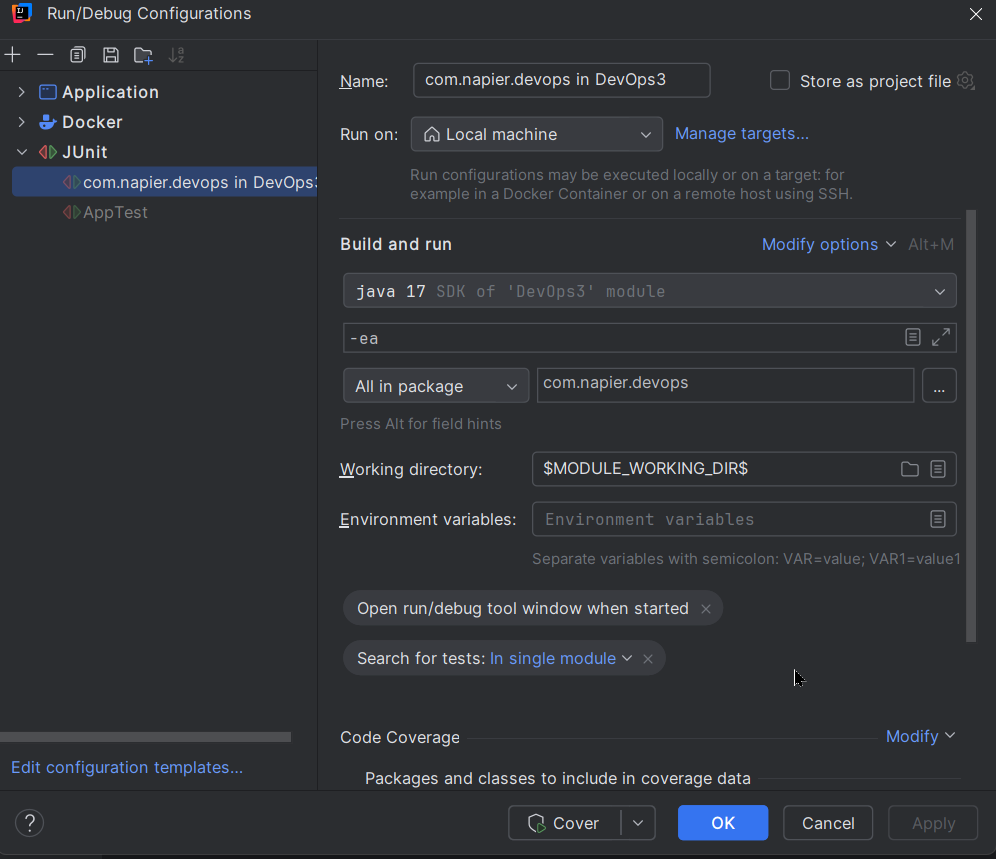


It details the percentage of classes, methods and lines covered by tests. **Double-click com.napier.devops** to open a per-class view:


As you can see, it is the `App` class that needs the most work. We can actually see the lines covered and not covered by tests in the source file:

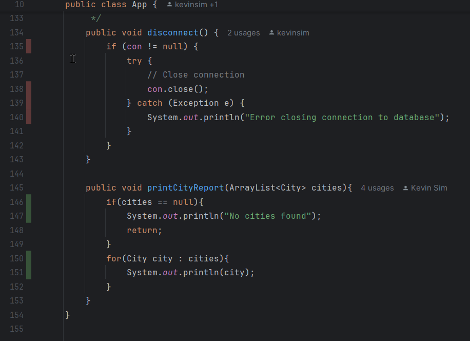

Lines with red next to them (e.g., lines 135 to 140) are not tested. Lines with green next to them (e.g., lines 146 to 151) are tested. This allows us to ensure **all** our code is tested.

We can also generate an HTML report. From the Run Menu select Generate Coverage Report

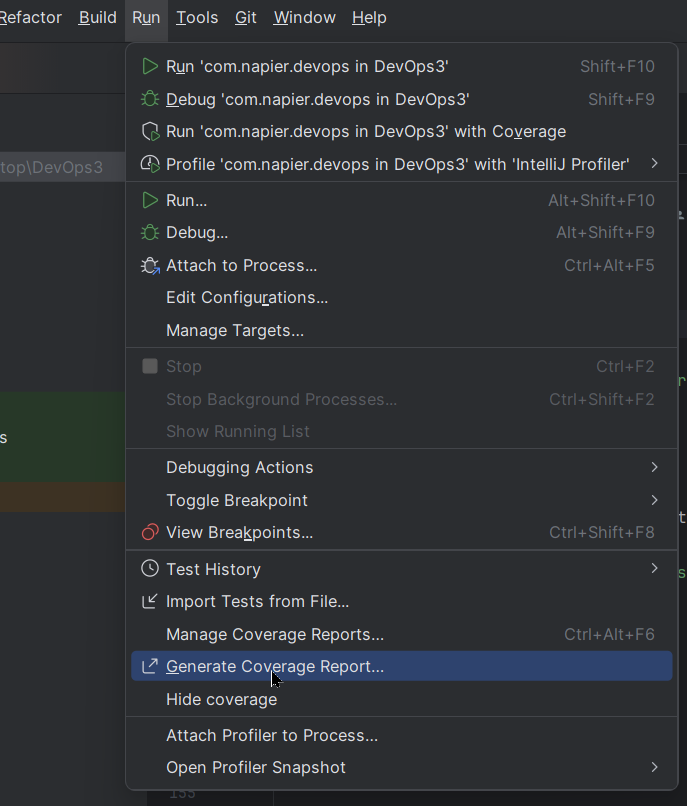


This will create a new Folder in your project with an HTML version of the coverage

## Update GitHub Actions for Unit Tests

We can separate the Unit Tests from our application in GitHub Actions.

Change your workflow main.yml to the following

```yml
1	name: A workflow for my App
2	on: push
3	
4	jobs:
5	  build:
6	    name: Test Build Action
7	    runs-on: ubuntu-20.04
8	    steps:
9	      - name: Checkout
10	        uses: actions/checkout@v4
11	      - name: Set up JDK 17
12	        uses: actions/setup-java@v4
13	        with:
14	          java-version: '17'
15	          distribution: 'adopt'
16	      - name: Unit Tests
17	        run: mvn -Dtest=com.napier.devops.AppTest test
18	      - name: Package and Run docker compose
19	        run: |
20	          mvn package -DskipTests
21	          docker compose up --abort-on-container-exit
```

Line 17 will run our test using maven

Lines 19-21 will package our application using maven, skipping tests then run docker compose

Note that when running Maven Package all commands above are executed so mvn package runs clean, validate compile and test before packaging

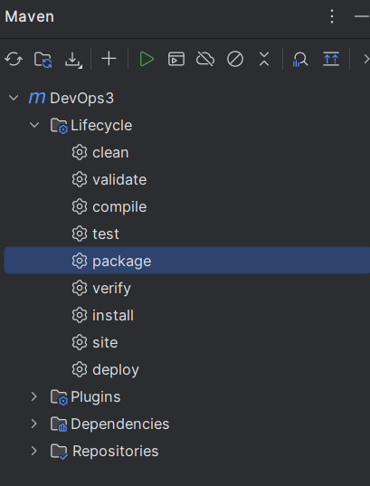

## Cleanup


Now clean-up as normal, ensuring you commit everything to GitHub, checking the our new GitHub Actions are successful. If they are you should see output similar to the following.

### Unit Tests

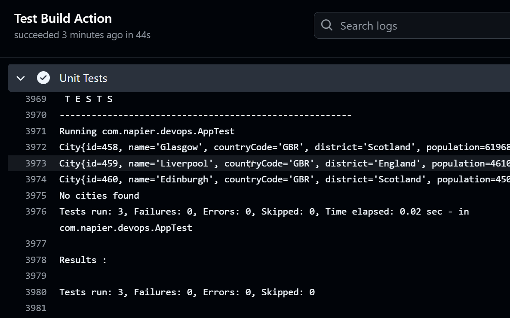


### Package and docker-compose


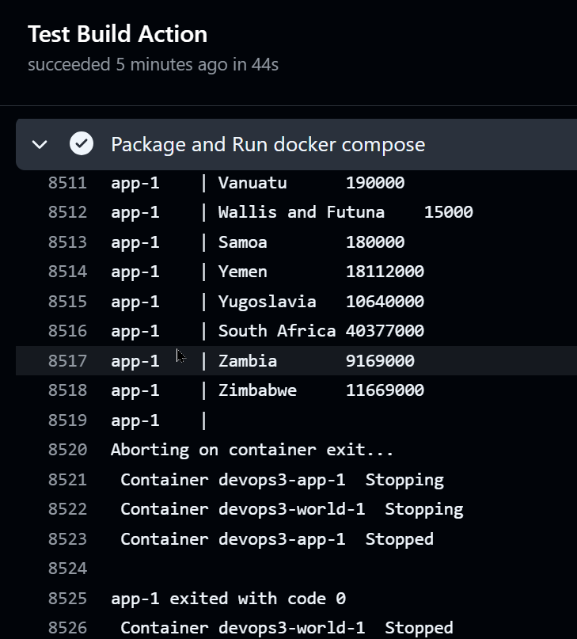