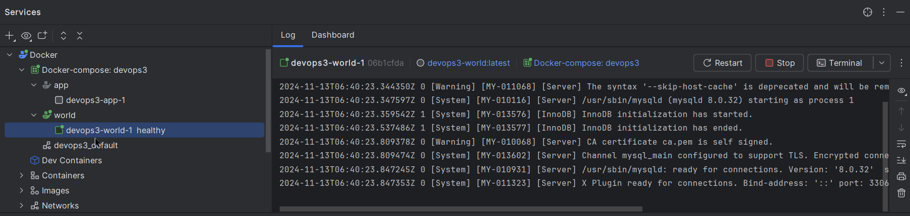
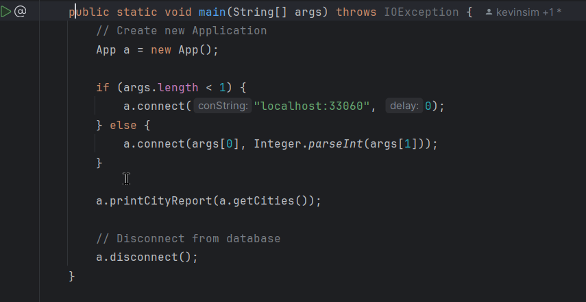
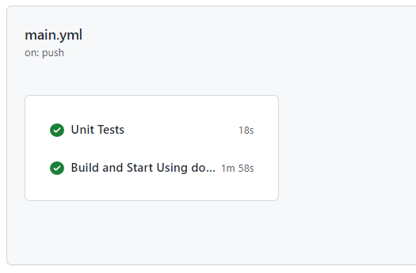
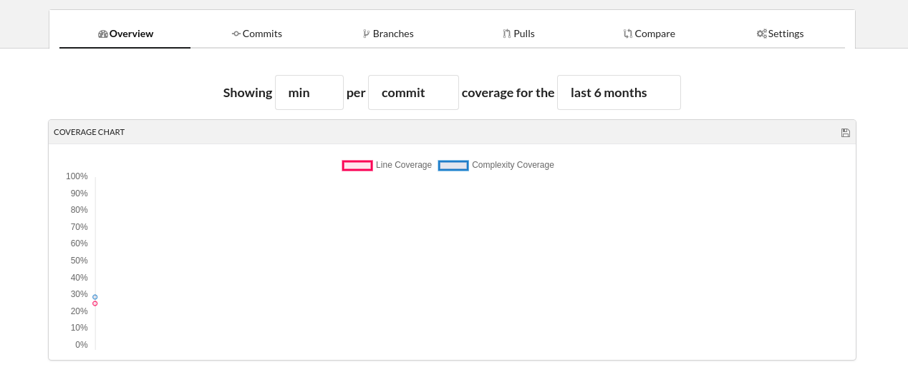
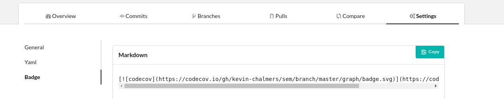

# New Lab 07: Integration Testing

In this lab we will build further automated tests for our project, focusing on integration testing. We will modify our App to allow local debugging to save time constantly building docker containers (you may have done this already) and add Integration testing to out GitHub Actions pipeline.

## Behavioural Objectives

- [ ] **Modify** *our App to allow local connections to the database for faster debugging.*
- [ ] **Create** *integration tests.*
- [ ] **Use code coverage** from *version control.*

## Updating Project

We have some tidying up in our existing project to make our life easier.  If you are using an older version of the labs then you may have an out of date MySQL connector. Check that the MySQL connector is set to version 8.0.18 in your `pom.xml` file that allows local connections. 

### Updating Maven `pom.xml` File

Update the dependencies section of your `pom.xml` to use version 8.0.18 of the mysql driver:

```xml
    <dependencies>
        <dependency>
            <groupId>mysql</groupId>
            <artifactId>mysql-connector-java</artifactId>
            <version>8.0.18</version>
        </dependency>
        <dependency>
            <groupId>org.junit.jupiter</groupId>
            <artifactId>junit-jupiter-api</artifactId>
            <version>5.1.0</version>
            <scope>test</scope>
        </dependency>
    </dependencies>
```

### Updating `App.java`

We will check our Java code is using the latest connector and modify our `App.java` file to allow the hostname and delay for the database to be set programmatically.  This will allow us to debug our code locally much more quickly than having to build docker containers each time a change is made.

#### Updating `connect`

Below is our updated `connect` method.  The updated lines are:

- The method definition adds `location` and `delay` parameters.
- `Class.forName` which uses the most up-to-date MySQL driver.
- `Driver.getConnection` uses the `location`, and also updates the parameters to use `allowPublicKeyRetrieval=true` as we are using a more up-to-date version of MySQL.

```java
       public void connect(String conString, int delay) {
		try {
			// Load Database driver
			Class.forName("com.mysql.cj.jdbc.Driver");
		} catch (ClassNotFoundException e) {
			System.out.println("Could not load SQL driver");
			System.exit(-1);
		}

		int retries = 10;
		for (int i = 0; i < retries; ++i) {
			System.out.println("Connecting to database...");
			try {
				// Wait a bit for db to start
				Thread.sleep(delay);
				// Connect to database
				con = DriverManager.getConnection("jdbc:mysql://" + conString
						+ "/world?allowPublicKeyRetrieval=true&useSSL"
						+ "=false", "root", "example");
				System.out.println("Successfully connected");
				break;
			} catch (SQLException sqle) {
				System.out.println("Failed to connect to database attempt "
						+ Integer.toString(i));
				System.out.println(sqle.getMessage());
			} catch (InterruptedException ie) {
				System.out.println("Thread interrupted? Should not happen.");
			}
		}
	}
```


#### Updating `main`

Modify the main method to use command line parameters, if supplied, or to default to localhost.

```java
      /**
	 * Connection to MySQL database.
	 */
	private Connection con = null;
	public static void main(String[] args) throws IOException {
		// Create new Application
		App a = new App();
		
        // if no parameters connect locally
		if (args.length < 1) {
			a.connect("localhost:33060", 0);
         // otherwise use connection string and delay passed as 
         // parameters from command line or DockerFile
		} else {
			a.connect(args[0], Integer.parseInt(args[1]));
		}

		a.printCityReport(a.getCities());
		a.report2();

		// Disconnect from database
		a.disconnect();
	}

```
#### Updating `pom.xml` to Set JAR Filename

At the start of the project we built a JAR file with the version number and `jar-with-dependencies` added to the name.  This has slowly become problematic with the number of files where our version number is provided.  Therefore, we will update the `pom.xml` file to produce a JAR file called `devops`.

The section we have to update is in the `<build><plugins>` section for the `maven-assembly-plugin`.  The updated version is below:

```xml
<plugin>
    <groupId>org.apache.maven.plugins</groupId>
    <artifactId>maven-assembly-plugin</artifactId>
    <version>3.3.0</version>
    <configuration>
        <finalName>devops</finalName>
        <archive>
            <manifest>
                <mainClass>com.napier.devops.App</mainClass>
            </manifest>
        </archive>
        <descriptorRefs>
            <descriptorRef>jar-with-dependencies</descriptorRef>
        </descriptorRefs>
        <appendassemblyId>false</appendassemblyId>
    </configuration>
    <executions>
        <execution>
            <id>make-assembly</id>
            <phase>package</phase>
            <goals>
                <goal>single</goal>
            </goals>
        </execution>
    </executions>
</plugin>
```

We have set `<finalName>` and stated we do not want the ID attached (`<appendassemblyId>` is set to `false`).  Our Maven build will now produce a file called `devops.jar`.

#### Updating `Dockerfile` for Application

Now we need to update the `Dockerfile` for the application to use the new JAR file name, and to provide the correct location for the database.  The updated `Dockerfile` is below.

```dockerfile
FROM openjdk:latest
COPY ./target/devops.jar /tmp
WORKDIR /tmp
ENTRYPOINT ["java", "-jar", "devops.jar", "world:3306", "30000"]
```

The last two parameters set the connection string and delay when connecting our App from a docker container `"world:3306", "30000"` When connecting locally the connection string is `"localhost:33060"` When connecting via Docker it is `"db:3306"` Where `db` is used as the URL of the database and is specified in the docker compose file

## Enabling Local Debugging

Make sure you have exposed the docker database port so we can connect locally on port 33060 or via a Docker container on port 3306

Your `docker-compose.yml` file should be:

```yml
version: '3'
services:
  # Build app from Dockerfile in same folder
  app:
    build: .

  # Build the db as name world from the Dockerfile in the db folder
  world:
    build: db/.
    ports:
      - "33060:3306"

```

The last line tells docker to make port 3306 available on our local machine on port 33060

Delete your old containers and images and restart the database from the docker compose file using the arrow at line 8 `world:`

You can leave the database running to save having to rebuild each time you want to connect. 

When the database is running and ready for connections the log from the docker container should show `ready for connections`:




You should now be able to run the App locally without having to package and build docker images

Just start the App directly  using the arrow next to the main method. As the database is running we can set the connection delay to zero



The new version of App should work locally either running directly or by starting from docker-compose and on GitHub Actions without any modification.

Test that all three scenarios are working

- Locally as described above by running the App directly
- Locally in docker using docker-compose to start the App (remember to delete target directory, old containers and images, repackage with maven, recreate and start App image using docker-compose )
- Remotely on GitHub Actions

We want to separate our tests into different files as we will have different types of tests.  Unit tests and integration tests are different, and we want to manage them as such.

### Adding GitHub Actions Job Stages

From the [Continuous Integration lecture](../../lectures/lecture15) we defined the following steps in a basic build script:

1. Clean.
2. Compile source code.
3. Integrate database.
4. Run tests.
5. Run inspections.
6. Deploy software.

We will update our GitHub Actions workflow to separate the different stages

```yml
name: A workflow for my Hello World App
on: push

jobs:
  UnitTests:
    name: Unit Tests
    runs-on: ubuntu-20.04
    steps:
      - name: Checkout
        uses: actions/checkout@v4
        with:
          submodules: recursive
      - name: Set up JDK 11
        uses: actions/setup-java@v2
        with:
          java-version: '11'
          distribution: 'adopt'
      - name: Unit Tests
        run: mvn -Dtest=com.napier.devops.AppTest test

  build:
    name: Build and Start Using docker-compose
    runs-on: ubuntu-20.04
    steps:
      - name: Checkout
        uses: actions/checkout@v4
        with:
          submodules: recursive
      - name: Set up JDK 11
        uses: actions/setup-java@v4
        with:
          java-version: '11'
          distribution: 'adopt'
      - name: Package and Run docker compose
        run: |
          mvn package -DskipTests
          docker compose up --abort-on-container-exit

```

We have separated our tasks into different jobs. This allows us to define build stages for more control. It also allows the different jobs to run concurrently on GitHub Actions speeding up the process. **Commit** and **push** this change.  If successful then you should see the different stages on GitHub Actions as shown below.



## Adding Integration Tests

Remember that Unit Tests are check the integrity of the smallest parts of our program. These do not need a connection to the database.  We are now ready to write integration tests.  These are tests against our database, and therefore we need to be connected.  Our tests will be written in the same manner as unit tests, but require a bit more configuration.

### Add a getCity() Method to our App

You can design your code however you wish and the following is used as a simple example of an integration test

I have added a City class as below

```java
package com.napier.devops;

/**
 * Object representation of the City Table from World database
 */
public class City {
	private long id;
	private String name;
	private String countryCode;
	private String district;
	private long population;

	public City(long id, String name, String countryCode, String district,
			long population) {
		this.id = id;
		this.name = name;
		this.countryCode = countryCode;
		this.district = district;
		this.population = population;
	}

	public long getId() {
		return id;
	}

	public String getName() {
		return name;
	}

	public String getCountryCode() {
		return countryCode;
	}

	public String getDistrict() {
		return district;
	}

	public long getPopulation() {
		return population;
	}

	@Override
	public String toString() {
		return "City{" + "id=" + id + ", name='" + name + '\''
				+ ", countryCode='" + countryCode + '\'' + ", district='"
				+ district + '\'' + ", population=" + population + '}';
	}
}

```

In the App class add a method to retrieve a City from its ID

```java
public City getCity(int id) {
    City city = null;
    try {

        // Create an SQL statement
        Statement stmt = con.createStatement();
        // Create string for SQL statement
        String sql = "select * from city where ID = " + id;
        // Execute SQL statement
        ResultSet rset = stmt.executeQuery(sql);
        //cycle
        if (rset.next()) {
            String name = rset.getString("Name");
            String countryCode = rset.getString("CountryCode");
            String district = rset.getString("District");
            Integer population = rset.getInt("Population");
            city = new City(id, name, countryCode, district, population);

        }

    } catch (Exception e) {
        System.out.println(e.getMessage());
        System.out.println("Failed to get details");
        return null;
    }
    return  city;
}
```


### Adding Integration Test File

Add a new Java file to the test folder called `AppIntegrationTest.java`.  The code for the file is below.

```java
package com.napier.devops;

import org.junit.jupiter.api.BeforeAll;
import org.junit.jupiter.api.Test;
import static org.junit.jupiter.api.Assertions.*;

public class AppIntegrationTest
{
	static App app;

	@BeforeAll
	static void init()
	{
		app = new App();
		app.connect("localhost:33060", 0);

	}

	@Test
	void testGetCity()
	{
		City city = app.getCity(1);
		assertEquals("Kabul", city.getName());
		System.out.println("successfully retrieved " + city);
	}
}
```

We are testing the `getCity` method of our App class to see if it returns a correct answer.  A random entry to the database has been used.  With this in place, we can update our GitHub Actions workflow.

### Update GitHub Actions

All we need to do now is update the GitHub Actions `main.yml` file to run our integration tests:

```yml
name: A workflow for my Hello World App
on:
  push:
    branches:
      - master
jobs:
  UnitTests:
    name: Unit Tests
    runs-on: ubuntu-20.04
    steps:
      - name: Checkout
        uses: actions/checkout@v4
        with:
          submodules: recursive
      - name: Set up JDK 11
        uses: actions/setup-java@v2
        with:
          java-version: '11'
          distribution: 'adopt'
      - name: Unit Tests
        run: mvn -Dtest=com.napier.devops.AppTest test

   IntegrationTests:
    name: Integration Test Build Action
    runs-on: ubuntu-20.04
    steps:
      - name: Checkout
        uses: actions/checkout@v4
      - name: Set up JDK 17
        uses: actions/setup-java@v4
        with:
          java-version: '17'
          distribution: 'adopt'
      - name: Integration Tests
        run: |
          docker build -t database ./db 
          docker run --name world -dp 33060:3306 database
          mvn -Dtest=com.napier.devops.AppIntegrationTest test
          docker stop world
          docker rm world
          docker image rm database     
  build:
    name: Build and Start Using docker-compose
    runs-on: ubuntu-20.04
    steps:
      - name: Checkout
        uses: actions/checkout@v4
        with:
          submodules: recursive
      - name: Set up JDK 11
        uses: actions/setup-java@v2
        with:
          java-version: '11'
          distribution: 'adopt'
      - name: Package and Run docker compose
        run: |
          mvn package -DskipTests
          docker compose up --abort-on-container-exit

```

We have added an `integration tests` stage to invoke `mvn test` on the `AppIntegrationTest` file.  **Commit and push** your changes and check that everything still works on GitHub Actions

## Exercise: Add Integration Tests

Now your task is to write integration tests to ensure that your application works correctly in all cases.  You have the template in `AppIntegrationTest.java`.  Add similar tests that test all the pathways and conditions through your code.

## Adding Code Coverage

Last week we looked at using IntelliJ to provide a code coverage report.  This is good for working at a single workstation, but our aim is to make information global.  Therefore, we will use an online code coverage tool to generate reports.

### Creating an Account with Codecov

We are going to use a service called [Codecov](https://codecov.io/).  First, you need to go to their website and signup via your GitHub account.  The process from then should be fairly straightforward, but if you have any problems ask.

### Updating `pom.xml` to Provide Code Coverage

We need Maven to generate reports for us.  There are different plugins that can do this for us, and we will use the jacoco one.  Add the following to the `plugins` section of the `pom.xml` file:

```xml
<plugin>
    <groupId>org.jacoco</groupId>
    <artifactId>jacoco-maven-plugin</artifactId>
    <version>0.8.2</version>
    <executions>
        <execution>
            <goals>
                <goal>prepare-agent</goal>
            </goals>
        </execution>
        <execution>
            <id>report</id>
            <phase>test</phase>
            <goals>
                <goal>report</goal>
            </goals>
        </execution>
    </executions>
</plugin>
```

That is all we have to do in our Maven file.  Everything else is automated.

### Updating `.main.yml` to Upload Code Coverage

We will add another action to the Integration Test stage of our GitHub Actions `main.yml` file to upload the coverage reports created during the maven test stage to codecov. 

```yml
name: A workflow for my Hello World App
on:
  push:
    branches:
      - master
      - lab08
jobs:
  UnitTests:
    name: Unit Tests
    runs-on: ubuntu-20.04
    steps:
      - name: Checkout
        uses: actions/checkout@v4
        with:
          submodules: recursive
      - name: Set up JDK 11
        uses: actions/setup-java@v2
        with:
          java-version: '11'
          distribution: 'adopt'
      - name: Unit Tests
        run: mvn -Dtest=com.napier.devops.AppTest test

  IntegrationTests:
    name: Integration Tests
    runs-on: ubuntu-20.04
    steps:
      - name: Checkout
        uses: actions/checkout@v4
        with:
          submodules: recursive
      - name: Set up JDK 11
        uses: actions/setup-java@v2
        with:
          java-version: '11'
          distribution: 'adopt'
      - name: Integration Tests and CodeCov
        run: |
          docker build -t database ./db 
          docker run --name employees -dp 33060:3306 database
          mvn -Dtest=com.napier.devops.AppIntegrationTest test          
          docker stop employees
          docker rm employees
          docker image rm database                    
      - name: CodeCov
        uses: codecov/codecov-action@v2
        with:
          # token: ${{ secrets.CODECOV_TOKEN }} # not required for public repos 
          directory: ./target/site/jacoco
          flags: Integration Tests # optional
          verbose: true # optional (default = false)
  build:
    name: Build and Start Using docker compose
    runs-on: ubuntu-20.04
    steps:
      - name: Checkout
        uses: actions/checkout@v4
        with:
          submodules: recursive
      - name: Set up JDK 11
        uses: actions/setup-java@v2
        with:
          java-version: '11'
          distribution: 'adopt'
      - name: Package and Run docker compose
        run: |
          mvn package -DskipTests
          docker compose up --abort-on-container-exit

```

The jacoco maven plugin creates html reports in the `./target/site/jacoco` folder. The new action shown below uploads this folder to `https://codecov.io`

```yml
    - name: CodeCov
        uses: codecov/codecov-action@v2
        with:
          # token: ${{ secrets.CODECOV_TOKEN }} # not required for public repos 
          directory: ./target/site/jacoco
          flags: Integration Tests # optional
          verbose: true # optional (default = false)
```


Now **commit and push** these changes.  GitHub Actions should undertake the build process, and once one stage is complete you can view it at `https://codecov.io/gh/<github-username>/<repo>`.  For example, `https://codecov.io/gh/kevin-sim/devops_employees`.



### Adding Your Code Coverage Badge

Under the *Settings* area of Codecov you will find the necessary markdown for your code coverage badge:



**Add the Markdown to your project `readme.md` for both the `master` and `develop` branches.**  This will allow you to see your code coverage status from your main GitHub project page.

## Cleanup

As always, cleanup your system.  Stop any running containers, commit everything, and bring your branches up-to-date.
